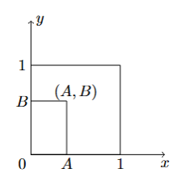

---
tags:
    - Joint Distributions
    - Conditional Distributions
    - Independence
    - Conditional Expectation
    - Covariance
    - Correlation
---

<h1 align="center">Joint Distributions and Dependence</h1>

A single random variable describes one aspect of an experiment. A joint distribution describes several quantities simultaneously and makes dependence visible. This session develops one connected workflow: construct a joint model, obtain marginals and conditional distributions, test independence, and quantify dependence through conditional expectation, covariance, and correlation.

The same ideas apply to discrete tables and continuous densities. Sums become integrals, and regions of possible values replace lists of admissible pairs. The core session emphasises joint PMFs and PDFs rather than lengthy joint-CDF casework. General change-of-variables methods, convolution, and the law of total variance are retained below as extension exercises rather than core theory.

#### Key Concepts

- Joint PMFs, joint PDFs, and support
- Marginal and conditional distributions
- Probabilities over two-dimensional regions
- Independence of two random variables
- Conditional expectation and two-variable LOTUS
- Covariance, correlation, and moments of sums

!!! tip "Learning Objectives"

    - Validate and use a joint PMF or joint PDF.
    - Derive marginal and conditional distributions.
    - Calculate probabilities and expectations over two-dimensional supports.
    - Determine whether two random variables are independent.
    - Calculate and interpret conditional expectation, covariance, and correlation.
    - Calculate the mean and variance of a sum of random variables.

### Session Preparation:

Attempt the core exercises from [Session 4](../04_Continuous_Random_Variables_II/README.md#exercises). Review conditional probability and the distinction between independence and mutually exclusive events.

**Syllabus and input**

- [Introduction to joint distributions](https://www.probabilitycourse.com/chapter5/5_1_0_joint_distributions.php)
- Discrete models: [joint PMFs](https://www.probabilitycourse.com/chapter5/5_1_1_joint_pmf.php) and [conditioning and independence](https://www.probabilitycourse.com/chapter5/5_1_3_conditioning_independence.php)
- Continuous models: [two continuous random variables](https://www.probabilitycourse.com/chapter5/5_2_0_continuous_vars.php), [joint PDFs](https://www.probabilitycourse.com/chapter5/5_2_1_joint_pdf.php), and [conditioning and independence](https://www.probabilitycourse.com/chapter5/5_2_3_conditioning_independence.php)
- [Conditional expectation](https://www.probabilitycourse.com/chapter5/5_1_5_conditional_expectation.php), through the law of total expectation
- [Functions of two continuous random variables](https://www.probabilitycourse.com/chapter5/5_2_4_functions.php), restricted to LOTUS
- [Covariance, correlation, and variance of a sum](https://www.probabilitycourse.com/chapter5/5_3_1_covariance_correlation.php)

**Existing course material**

- [Joint-distribution recap notes](https://drive.google.com/file/d/11-lAHXLQO_PRv2xqHwjoZv66-PY9X-9x/view?usp=sharing)
- [Session notes](https://drive.google.com/file/d/1oUHWdzQZa62bTqsmLe_eRts7OpOEhFgJ/view?usp=sharing)
- [Joint-distribution material](https://viaucdk-my.sharepoint.com/:f:/g/personal/rib_viauc_dk/EoKqqy67NdBBk7Qnug21TH4BXHHtg2jlNNSF45_H9n7feg?e=3dBknY)
- [Dependence recap exercises](https://drive.google.com/file/d/15LXt_ODdG0qUIhZmrPiXvwHjChZpQwCH/view?usp=sharing)
- [Dependence material](https://viaucdk-my.sharepoint.com/:f:/g/personal/rib_viauc_dk/EnYOFBJCZ-hNtWAfipCS0pUB6xsNt8lOW1fDyq_l_vNqUg?e=BSqiaH)

### Core exercises

#### Exercise 1 - Joint PMF table

The joint PMF of $X$ and $Y$ is:

| $y\backslash x$ | 1 | 2 | 3 |
| --- | ---: | ---: | ---: |
| 5 | $1/12$ | 0 | 0 |
| 6 | $2/12$ | 0 | $2/12$ |
| 7 | $2/12$ | $1/12$ | $2/12$ |
| 8 | 0 | $2/12$ | 0 |

1. Find the marginal PMFs of $X$ and $Y$.
2. Find $E[X]$, $E[Y]$, and $E[XY]$.
3. Determine whether $X$ and $Y$ are independent.
4. Find $p_{X\mid Y}(x\mid6)$.
5. Find $E[X\mid Y=y]$ for every possible value of $y$, and verify the law of total expectation.

??? answer

    For $x=1,2,3$, $p_X=(5/12,3/12,4/12)$. For $y=5,6,7,8$, $p_Y=(1/12,4/12,5/12,2/12)$. Moreover,

    \[
    E[X]=\frac{23}{12},\qquad E[Y]=\frac{20}{3},\qquad E[XY]=\frac{155}{12}.
    \]

    The variables are not independent. Given $Y=6$, $X=1$ and $X=3$ each have probability $1/2$. The conditional means are $1$ for $Y=5$ and $2$ for $Y=6,7,8$. Therefore

    \[
    E[E[X\mid Y]]=1\left(\frac1{12}\right)+2\left(\frac{11}{12}\right)=\frac{23}{12}=E[X].
    \]

#### Exercise 2 - A joint PDF on a rectangular support

Let

\[
f_{X,Y}(x,y)=\begin{cases}
\frac12e^{-x}+\frac{cy}{(1+x)^2},&x\ge0,\ 0\le y\le1,\\
0,&\text{otherwise}.
\end{cases}
\]

1. Find $c$.
2. Find $P(0\le X\le1,0\le Y\le1/2)$.
3. Derive the marginal PDF of $X$.
4. Explain how you could test independence using the two marginal PDFs.

??? answer

    Normalisation gives $c=1$. The requested probability is

    \[
    \frac14(1-e^{-1})+\frac1{16}.
    \]

    The marginal density is

    \[
    f_X(x)=\frac12e^{-x}+\frac{1}{2(1+x)^2},\qquad x\ge0.
    \]

    Integrating over $x$ gives $f_Y(y)=1/2+y$ on $[0,1]$. The joint density does not equal $f_X(x)f_Y(y)$, so $X$ and $Y$ are not independent.

#### Exercise 3 - A triangular support

Suppose $f_{X,Y}(x,y)=c(x+y)$ on $x\ge0$, $y\ge0$, and $x+y\le1$, and is zero elsewhere.

1. Sketch the support and find $c$.
2. Derive both marginal PDFs.
3. Find $P(X+Y\le1/2)$.
4. Determine whether $X$ and $Y$ are independent.

??? answer

    Integrating over the triangle gives $c=3$. For $0\le x\le1$,

    \[
    f_X(x)=\int_0^{1-x}3(x+y)\,dy=\frac32(1-x^2),
    \]

    and symmetry gives $f_Y(y)=\frac32(1-y^2)$ on $[0,1]$. Integrating over the smaller triangle $x+y\le1/2$ gives $P(X+Y\le1/2)=1/8$. The variables are not independent; the triangular support is not a Cartesian product of the marginal supports.

#### Exercise 4 - Conditional density

For $x>0$, suppose

\[
f_{Y\mid X}(y\mid x)=xe^{-xy},\qquad y>0.
\]

1. Find $P(Y<2\mid X=2)$.
2. Find $E[Y\mid X=2]$.
3. Express $E[Y\mid X]$ as a function of $X$.

??? answer

    Given $X=x$, $Y$ is exponential with rate $x$. Therefore the first two answers are $1-e^{-4}$ and $1/2$, and $E[Y\mid X]=1/X$.

#### Exercise 5 - Covariance and correlation

The joint PMF is:

|  | $Y=0$ | $Y=1$ | $Y=2$ |
| --- | ---: | ---: | ---: |
| $X=0$ | $1/6$ | $1/4$ | $1/8$ |
| $X=1$ | $1/8$ | $1/6$ | $1/6$ |

1. Find $\operatorname{Cov}(X,Y)$.
2. Find $\rho(X,Y)$.
3. Explain why a small correlation does not imply independence.

??? answer

    $E[X]=11/24$, $E[Y]=1$, and $E[XY]=1/2$, so $\operatorname{Cov}(X,Y)=1/24$. The correlation is

    \[
    \rho(X,Y)=\frac{2\sqrt3}{\sqrt{1001}}\approx0.1095.
    \]

    The variables are not independent because, for example, the joint probabilities do not all equal the products of the corresponding marginals. A small correlation describes weak linear association, not independence.

#### Exercise 6 - Moments of a sum

Let $X_1,\ldots,X_n$ have common mean $\mu$, common variance $\sigma^2$, and common pairwise covariance $c$ for distinct pairs. Define $S_n=\sum_iX_i$.

1. Find $E[S_n]$ and $\operatorname{Var}(S_n)$.
2. What changes when the variables are independent?
3. Simulate both an independent and a positively correlated example in Python and compare the spread of $S_n$.

??? answer

    \[
    E[S_n]=n\mu,\qquad
    \operatorname{Var}(S_n)=n\sigma^2+n(n-1)c.
    \]

    Independence sets $c=0$, giving $\operatorname{Var}(S_n)=n\sigma^2$. Positive covariance makes the sum more variable. The simulation should compare empirical variances with these formulas, not only the appearance of the histograms.

### Further exercises

The following exercises provide additional practice or extend the core session. Exercises 13 and 14 introduce the law of total variance and convolution, which are not required core derivations in this session.

#### Exercise 7 - Probability as area

Choose $(A,B)$ uniformly in the unit square. What is the probability that

\[
At^2+t+B=0
\]

has real solutions in the unknown $t$?

  

??? answer

    The discriminant condition is $1-4AB\ge0$. The required area is

    \[
    \frac14+\frac14\ln4\approx0.5966.
    \]

    See the [extended solution](src/Solution7.pdf).

#### Exercise 8 - A finite joint model

Let

\[
C=\{(x,y)\mid x,y\in\mathbb Z,\ x^2+|y|\le2\},
\]

and choose $(X,Y)$ uniformly from $C$.

1. List the points in $C$.
2. Construct the joint and marginal PMFs.
3. Find the conditional PMF of $X$ given $Y=1$.
4. Determine whether $X$ and $Y$ are independent.

??? answer

    There are 11 points: five with $x=0$ and three for each of $x=-1$ and $x=1$. Each point has probability $1/11$. Given $Y=1$, $X$ is uniform on $\{-1,0,1\}$. The variables are not independent because the possible values of $Y$ depend on $X$.

#### Exercise 9 - A second joint PMF

The joint PMF of $X$ and $Y$ is:

| $y\backslash x$ | 4 | 5 | 7 |
| --- | ---: | ---: | ---: |
| -3 | $k$ | 0 | 0 |
| -1 | $2/10$ | 0 | $k$ |
| 0 | $1/10$ | 0 | $4/10$ |
| 5 | 0 | $k$ | 0 |

1. Find $k$ and both marginal PMFs.
2. Find $E[X]$, $E[Y]$, and $E[XY]$.
3. Find $P(X<6,Y<0)$.
4. Determine whether $X$ and $Y$ are independent.

??? answer

    Normalisation gives $k=0.1$. For $x=4,5,7$, $p_X=(0.4,0.1,0.5)$; for $y=-3,-1,0,5$, $p_Y=(0.1,0.3,0.5,0.1)$. Furthermore,

    \[
    E[X]=\frac{28}{5},\qquad E[Y]=-\frac1{10},\qquad E[XY]=-\frac15,
    \]

    and $P(X<6,Y<0)=0.3$. The variables are not independent.

#### Exercise 10 - An infinite discrete joint model

Let

\[
p_{X,Y}(k,l)=\frac{1}{2^{k+l}},\qquad k,l=1,2,\ldots
\]

1. Verify that this is a valid joint PMF.
2. Find the marginal PMFs.
3. Determine whether $X$ and $Y$ are independent.
4. Find $P(X^2+Y^2\le10)$.

??? answer

    Each marginal is $P(X=k)=2^{-k}$, and the joint PMF factors into the product of the marginals, so the variables are independent. The admissible pairs in part 4 are $(1,1),(1,2),(2,1),(2,2),(1,3),(3,1)$, giving probability $11/16$.

#### Exercise 11 - Conditional moments

Continue with the uniform model from Exercise 8.

1. Find $E[XY^2]$.
2. Find $E[X\mid Y=1]$ and $\operatorname{Var}(X\mid Y=1)$.
3. Find $E[X\mid |Y|\le1]$ and $E[X^2\mid |Y|\le1]$.

??? answer

    Symmetry gives $E[XY^2]=0$. Given $Y=1$, $X$ is uniform on $\{-1,0,1\}$, so the conditional mean is $0$ and the variance is $2/3$. Conditioning on $|Y|\le1$ gives a uniform $3\times3$ grid; the last two answers are $0$ and $2/3$.

#### Exercise 12 - Covariance after transformation

Let $X$ and $Y$ be independent standard normal random variables and define

\[
Z=11-X+X^2Y,\qquad W=3-Y.
\]

1. Expand $\operatorname{Cov}(Z,W)$ using linearity.
2. Identify which terms vanish because of independence or zero means.
3. Find $\operatorname{Cov}(Z,W)$.
4. Explain why the nonlinear term $X^2Y$ still contributes.

??? answer

    Constants contribute nothing. Independence gives $\operatorname{Cov}(X,Y)=0$, while

    \[
    \operatorname{Cov}(X^2Y,Y)=E[X^2]E[Y^2]=1.
    \]

    Because $W=3-Y$, $\operatorname{Cov}(Z,W)=-1$. The nonlinear term contributes because $X^2Y$ and $Y$ share the factor $Y$.

#### Exercise 13 - Total expectation and total variance

A request is routed to a fast server with probability 0.7 and a slow server with probability 0.3. Conditional response times are exponential with means 20 ms and 80 ms, respectively. Let $T$ be the response time and $S$ the selected server.

1. Find $E[T\mid S]$ and $\operatorname{Var}(T\mid S)$.
2. Use the law of total expectation to find $E[T]$.
3. Use $\operatorname{Var}(T)=E[\operatorname{Var}(T\mid S)]+\operatorname{Var}(E[T\mid S])$ to find $\operatorname{Var}(T)$.
4. Find $P(S=\text{slow}\mid T>100)$.

??? answer

    The conditional means are 20 and 80 ms, and the conditional variances are $400$ and $6400$ ms$^2$. Thus

    \[
    E[T]=0.7(20)+0.3(80)=38\text{ ms}
    \]

    and

    \[
    \operatorname{Var}(T)=0.7(400)+0.3(6400)+0.7(20-38)^2+0.3(80-38)^2=2956\text{ ms}^2.
    \]

    Bayes' rule gives

    \[
    P(S=\text{slow}\mid T>100)
    =\frac{0.3e^{-100/80}}{0.7e^{-100/20}+0.3e^{-100/80}}
    \approx0.948.
    \]

#### Exercise 14 - Sum of two uniforms

Let $X$ and $Y$ be independent $\operatorname{Uniform}(0,1)$ variables and define $S=X+Y$.

1. Using $f_S(s)=\int_{-\infty}^{\infty}f_X(x)f_Y(s-x)\,dx$, derive the PDF of $S$.
2. Derive the CDF of $S$ geometrically from the unit square.
3. Find $P(0.5<S<1.5)$.
4. Simulate $S$ and compare its histogram with the theoretical PDF.

??? answer

    The PDF is

    \[
    f_S(s)=\begin{cases}
    s,&0<s<1,\\
    2-s,&1\le s<2,\\
    0,&\text{otherwise}.
    \end{cases}
    \]

    The CDF is $s^2/2$ for $0\le s\le1$ and $1-(2-s)^2/2$ for $1<s\le2$, with the usual values 0 and 1 outside the support. Symmetry gives $P(0.5<S<1.5)=3/4$.
