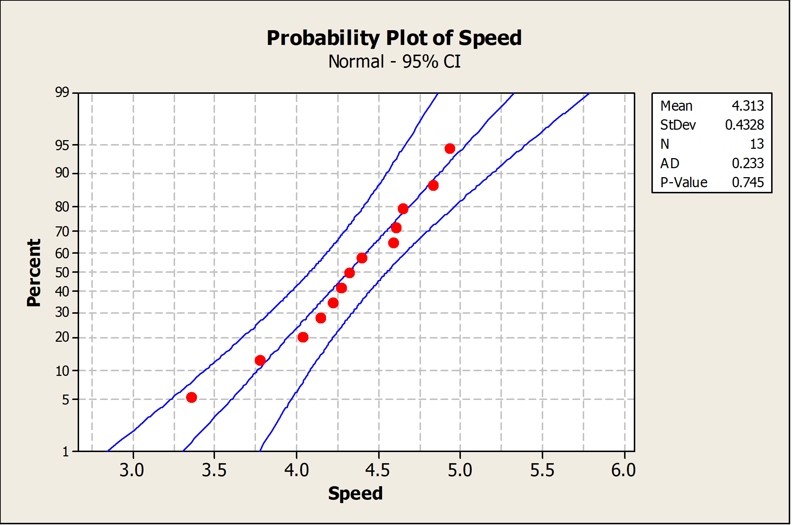

<h1 align="center">06 Point Estimation, Sampling and Statistical Intervals</h1>

### Session Preparation:
ASPE: 7 (not 7.3.4 and 7.4.3) + 8 (not 8.6)

Solve the [exercises from session 5](https://rbrooksdk.github.io/SMP1_26/05_MVR_part_2/#exercises) before class.

### Session Material

[Recap exercises](https://drive.google.com/file/d/1OZGJcv1RZfFxp31RFctEJI8GoogfeRmi/view?usp=sharing)

[Session Notes](https://drive.google.com/file/d/1EFr1Pz5E2lyVtgxd2Lwj9O4SdvcyXw_x/view?usp=sharing)

[Session material](https://viaucdk-my.sharepoint.com/:f:/g/personal/rib_viauc_dk/EoY5rMCapgZLjtOdxkhvvVoBh_QnTKnGGcTPPM5vjoHd4w?e=Itlujg)

### Session Description
You will most likely experience that the next 2–3 topics are a bit less complex than the previous three topics.

Point estimation and sampling are important concepts in statistics. Point estimation involves using a statistic, such as the sample mean or proportion, to estimate an unknown population parameter. The goal is to find the value of the statistic that is most likely to be the true value of the parameter. Sampling, on the other hand, involves selecting a subset of individuals from a larger population and using their data to make inferences about the entire population. The key to effective sampling is ensuring that the sample is representative of the population and that the sample size is large enough to accurately estimate the population parameter of interest. Together, point estimation and sampling provide a framework for making accurate and reliable statistical inferences.

Statistical intervals are a way of expressing the uncertainty associated with a statistical estimate. They provide a range of values within which the true value of a population parameter or a future observation is likely to fall, based on a sample of data. Confidence intervals estimate the value of a population parameter with a measure of uncertainty, while prediction intervals provide a range of values for a future observation, taking into account both the uncertainty associated with estimating the population parameter and the variability associated with predicting individual observations. Statistical intervals are commonly used in various fields to estimate population parameters or future outcomes with a measure of precision and reliability.

#### Key Concepts
- Sampling Distribution
- Central Limit Theorem
- Standard Error
- CI for mean
- CI for proportion
- CI for variance
- Tolerance and prediction interval

---

### Exercises

Full solutions to the book exercises can be found in the [general resource folder](https://viaucdk-my.sharepoint.com/:f:/g/personal/rib_viauc_dk/Egbdbeb9oy1Oqk8hReXf2-wBibryPlLiVj2ujGdsvH5--w?e=liO02A)

Note, sometimes we use '$=$' instead of '$\approx$' when we state probabilities with a given decimal precision.

#### Exercise 0
Also do exercises 6-8 from the previous session.

#### Exercise 1 (Book 8.1.7)
A manufacturer produces piston rings for an automobile engine. It is known that ring diameter is normally distributed with $\sigma=0.001$ millimeters. A random sample of 15 rings has a mean diameter of $\bar{x}=74.036$ millimeters.

1. Construct a $99 \%$ two-sided confidence interval on the mean piston ring diameter.
2. Construct a $99 \%$ lower-confidence bound on the mean piston ring diameter. Compare the lower bound of this confidence interval with the one in part (a).

??? answer
    1. $99 \%$ Two-sided CI on the true $m$ ean piston ring diam eter
    For $\alpha=0.01, z_{\alpha / 2}=20.005=2.58$, and $\bar{x}=74.036, \sigma=0.001, n=15$

        $$
        \begin{gathered}
        \bar{x}-z_{0005}\left(\frac{\sigma}{\sqrt{n}}\right) \leq \mu \leq \bar{x}+z_{0.00 s}\left(\frac{\sigma}{\sqrt{n}}\right) \\
        74.036-2.58\left(\frac{0.001}{\sqrt{15}}\right) \leq \mu \leq 74.036+2.58\left(\frac{0.001}{\sqrt{15}}\right) \\
        74.0353 \leq \mu \leq 74.0367
        \end{gathered}
        $$

    2. $99 \%$ One-sided CI on the true $m$ ean piston ring diam eter
    For $\alpha=0.01, z_a=z_{0.01}=2.33$ and $\bar{x}=74.036, \sigma=0.001, n=15$

        $$
        \begin{aligned}
        & x-z_{0.01} \frac{\sigma}{\sqrt{n}} \leq \mu \\
        & 74.036-2.33\left(\frac{0.001}{\sqrt{15}}\right) \leq \mu \\
        & 74.03574 \leq \mu
        \end{aligned}
        $$

#### Exercise 2 (Book 8.1.8)
A civil engineer is analyzing the compressive strength of concrete. Compressive strength is normally distributed with $\sigma^2=1000(\mathrm{psi})^2$. A random sample of 12 specimens has a mean compressive strength of $\bar{x}=3250$ psi.

1. Construct a $95 \%$ two-sided confidence interval on mean compressive strength.
2. Construct a $99 \%$ two-sided confidence interval on mean compressive strength. Compare the width of this confidence interval with the width of the one found in part (a).

??? answer
    1. $95 \%$ two sided CI on the $m$ ean com pressive strength

        $$
        \begin{aligned}
        & z_{\alpha / 2}=z_{0.025}=1.96, \text { and } \bar{x}=3250, \sigma^2=1000, n=12 \\
        & \overline{\bar{x}}-z_{0.025}\left(\frac{\sigma}{\sqrt{n}}\right) \leq \mu \leq \bar{x}+z_{0.025}\left(\frac{\sigma}{\sqrt{n}}\right) \\
        & 3250-1.96\left(\frac{31.62}{\sqrt{12}}\right) \leq \mu \leq 3250+1.96\left(\frac{31.62}{\sqrt{12}}\right) \\
        & 3250-17.89 \leq \mu \leq 3250+17.89 \\
        & 3232.11 \leq \mu \leq 3267.89
        \end{aligned}
        $$

    2. $99 \%$ Two-sided CI on the true $m$ ean com pressive strength

        $$
        \begin{aligned}
        z_{\alpha / 2}= & z_{0.005}= \\
        & 2.58 \\
        \bar{x} & -z_{0.005}\left(\frac{\sigma}{\sqrt{n}}\right) \leq \mu \leq \bar{x}+z_{0.005}\left(\frac{\sigma}{\sqrt{n}}\right)
        \end{aligned}
        $$

#### Exercise 3 (Book 8.2.10)
An article in Computers & Electrical Engineering ["Parallel Simulation of Cellular Neural Networks" (1996, Vol. 22, pp. 61-84)] considered the speedup of cellular neural networks (CNNs) for a parallel general-purpose computing architecture based on six transputers in different areas. The data follow:

| 3.775302 | 3.350679 | 4.217981 | 4.030324 | 4.639692 |
| :--- | :--- | :--- | :--- | :--- |
| 4.139665 | 4.395575 | 4.824257 | 4.268119 | 4.584193 |
| 4.930027 | 4.315973 | 4.600101 |  |  |

1. Is there evidence to support the assumption that speedup of CNN is normally distributed? Include a graphical display in your answer.
2. Construct a $95 \%$ two-sided confidence interval on the mean speedup.
3. Construct a $95 \%$ lower confidence bound on the mean speedup.

??? answer
    1. The data appear to be normally distributed based on examination of the normal probability plot below.
        

            
        

    2. $95 \%$ confidence interval on mean speed-up

        $$
        \begin{aligned}
        & n=13 \quad \bar{x}=4.313 \quad s=0.4328 \quad t_{0.025,12}=2.179 \\
        & \bar{x}-t_{0.025,12}\left(\frac{s}{\sqrt{n}}\right) \leq \mu \leq \bar{x}+t_{0.025,12}\left(\frac{s}{\sqrt{n}}\right) \\
        & 4.313-2.179\left(\frac{0.4328}{\sqrt{13}}\right) \leq \mu \leq 4.313+2.179\left(\frac{0.4328}{\sqrt{13}}\right) \\
        & 4.051 \leq \mu \leq 4.575
        \end{aligned}
        $$

    3. $95 \%$ lower confidence bound on mean speed-up

        \begin{aligned}
        & n=13 \quad \bar{x}=4.313 \quad s=0.4328 \quad t_{0.05,12}=1.782 \\
        & \bar{x}-t_{0.05,12}\left(\frac{s}{\sqrt{n}}\right) \leq \mu \\
        & 4.313-1.782\left(\frac{0.4328}{\sqrt{13}}\right) \leq \mu \\
        & 4.099 \leq \mu
        \end{aligned}

#### Exercise 4 (Book 8.3.5)
An article in Technometrics ["Two-Way Random Effects Analyses and Gauge R\&R Studies" (1999, Vol. 41(3), pp. 202-211)] studied the capability of a gauge by measuring the weight of paper. The data for repeated measurements of one sheet of paper are in the following table. Construct a $95 \%$ one-sided upper confidence interval for the standard deviation of these measurements. Check the assumption of normality of the data and comment on the assumptions for the confidence interval.

| Observations |  |  |  |  |
| :--- | :--- | :--- | :--- | :--- |
| 3.481 | 3.448 | 3.485 | 3.475 | 3.472 |
| 3.477 | 3.472 | 3.464 | 3.472 | 3.470 |
| 3.470 | 3.470 | 3.477 | 3.473 | 3.474 |

??? answer
    $95 \%$ confidence interval for $\sigma$

    $$
    \begin{aligned}
    n=15 \quad s=0.00831 \\
    \chi_{1-\alpha, n-1}^2 & =\chi_{0.95,14}^2=6.53 \\
    \sigma^2 & \leq \frac{14(0.00831)^2}{6.53} \\
    \sigma^2 & \leq 0.000148 \\
    \sigma & \leq 0.0122
    \end{aligned}
    $$

    The data do not appear to be normally distributed based on an examination of the normal probability plot below. Therefore, the $95 \%$ confidence interval for $\sigma$ is not valid.

#### Exercise 5 (Book 8.4.1)
The 2004 presidential election exit polls from the critical state of Ohio provided the following results. The exit polls had 2020 respondents, 768 of whom were college graduates. Of the college graduates, 412 voted for George Bush.

1. Calculate a $95 \%$ confidence interval for the proportion of college graduates in Ohio who voted for George Bush.
2. Calculate a $95 \%$ lower confidence bound for the proportion of college graduates in Ohio who voted for George Bush.

??? answer
    1. $95 \%$ confidence interval for the proportion of college graduates in Ohio that voted for George Bush.

        $$
        \begin{gathered}
        \hat{p}=\frac{412}{768}=0.536 \quad n=768 z_{\alpha / 2}=1.96 \\
        \hat{p}-z_{\alpha / 2} \sqrt{\frac{\hat{p}(1-\hat{p})}{n}} \leq p \leq \hat{p}+z_{\alpha / 2} \sqrt{\frac{\hat{p}(1-\hat{p})}{n}} \\
        0.536-1.96 \sqrt{\frac{0.536(0.464)}{768}} \leq p \leq 0.536+1.96 \sqrt{\frac{0.536(0.464)}{768}} \\
        0.501 \leq p \leq 0.571
        \end{gathered}
        $$

    2. $95 \%$ lower confidence bound on the proportion of college graduates in Ohio that voted for George Bush.

        $$
        \begin{aligned}
        \hat{p}-z_\alpha \sqrt{\frac{\hat{p}(1-\hat{p})}{n}} & \leq p \\
        0.536-1.645 \sqrt{\frac{0.536(0.464)}{768}} & \leq p \\
        0.506 & \leq p
        \end{aligned}
        $$

#### Exercise 6 (Book 7.2.8)
Scientists at the Hopkins Memorial Forest in western Massachusetts have been collecting meteorological and environmental data in the forest data for more than 100 years. In the past few years, sulfate content in water samples from Birch Brook has averaged \(7.48 \mathrm{mg} / \mathrm{L}\) with a standard deviation of \(1.60 \mathrm{mg} / \mathrm{L}\).

1. What is the standard error of the sulfate in a collection of 10 water samples?
2. If 10 students measure the sulfate in their samples, what is the probability that their average sulfate will be between 6.49 and \(8.47 \mathrm{mg} / \mathrm{L}\) ?
3. What do you need to assume for the probability calculated in (b) to be accurate?

??? answer
    1. \(SE = 0.51\)
    2. \(P(6.49 < \bar{X} < 8.47) = 0.95\)
    3. The samples are independent. And that the population is normally distributed, or the sample size is large.

#### Exercise 7 (Book 7.2.10)
Researchers in the Hopkins Forest (see Exercise 7.2.8) also count the number of maple trees (genus acer) in plots throughout the forest. The following is a histogram of the number of live maples in 1002 plots sampled over the past 20 years. The average number of maples per plot was 19.86 trees with a standard deviation of 23.65 trees.

1. If we took the mean of a sample of eight plots, what would be the standard error of the mean?
2. Using the central limit theorem, what is the probability that the mean of the eight would be within 1 standard error of the mean?
3. Why might you think that the probability that you calculated in (b) might not be very accurate?

??? answer
    1. \(SE = 8.36\)
    2. \(0.68\)
    3. The central limit theorem applies when the sample size $n$ is large. Here $n = 8$ may be too small because the distribution of the counts of maple trees is quite skewed (which you can see in the histogram in the solutions from the book).

#### Exercise 8
The number of accidents in a certain city is modeled by a Poisson random variable with average rate of 10 accidents per day. Suppose that the number of accidents in different days are independent. Use the central limit theorem to find the probability that there will be more than 3800 accidents in a certain year. Assume that there are 365 days in a year.

??? answer
    \(P(Y \geq 3800) \approx 0.0065\)

---
